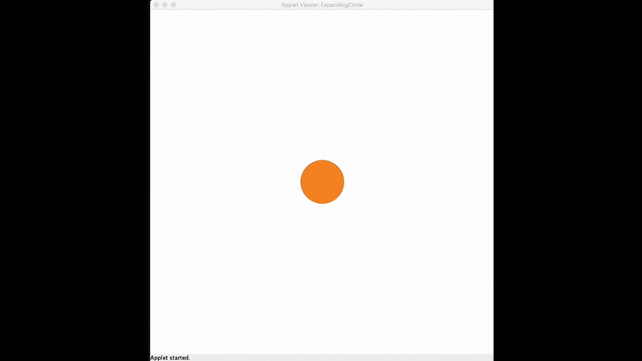

# U10 | Expanding Circle

Schreiben Sie ein Programm auf der Basis der GraphicsApp, das einen wachsenden Kreis animiert. In der Mitte der Zeichenfläche wird eine Ellipse dargestellt, die mit jedem Aufruf der `draw`-Methode um `1px` in beide Dimensionen wächst. Nutzen Sie zur Animation das Muster, das in
der Vorlesung im Rahmen des *draw loops* vorgestellt wurde.

Definieren Sie in Ihrem Programm zwei Konstanten für einen initialen (`50px`) sowie einen maximalen Radius (`250px`) für die Ellipse. Sobald der maximale Wert erreicht ist, wird die Ellipse auf die ursprüngliche Größe zurückgesetzt. Die Animation `[initialer Radius -> maximaler Radius]` soll sich endlos wiederholen.

| So soll der Expanding Circle aussehen. |
|:----:|
|  |
